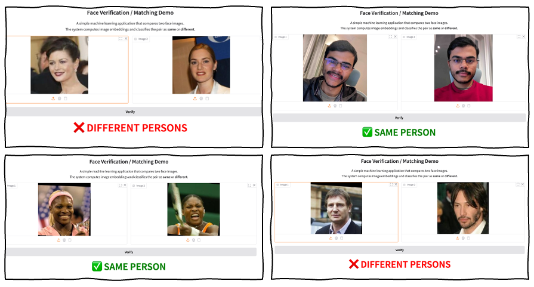
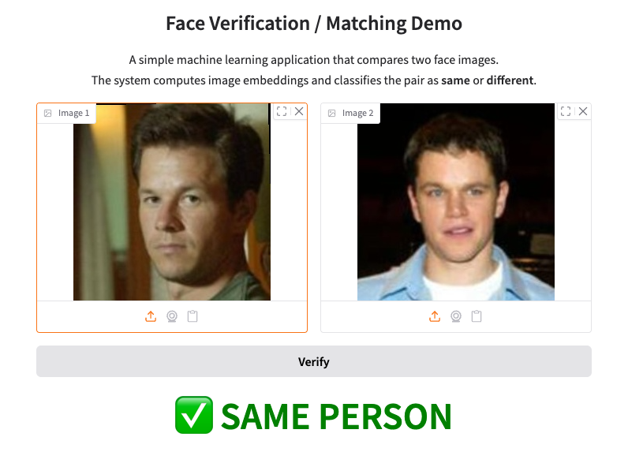
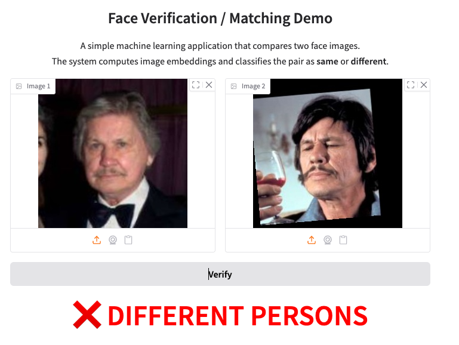

# Face Verification Service

<p align="center">
  
</p>

## Problem Description

Modern photo applications (e.g. Google Photos) automatically group images by person without requiring predefined identities.
At the core of such systems is **face verification**: given two face images, decide whether they belong to the same person.

This project implements a **face verification service** that can later be used as a plug-and-play module in a larger photo organization system. The service takes two face images as input and performs a **binary classification** (`same person` / `different person`).

The project focuses on **verification**, not closed-set face recognition, as verification is the fundamental building block for scalable, open-set photo libraries.

In short, the goal is to do the following task

```
Given (face_A, face_B) → same person or not
```

## Environment setup

```bash
python -m venv faceEnv
source faceEnv/bin/activate #Mac
faceEnv\Scripts\activate #Windows
pip install -r requirements.txt
```

## Dataset

We use the **Labeled Faces in the Wild (LFW)** dataset:

* Collection of face images of public figures
* Faces are already detected and aligned
* Standard benchmark for face verification

***Downloading the dataset***:

Dataset was taken from scikit-learn and then processed to generate matching and non-matching pairs. 

```
from sklearn.datasets import fetch_lfw_people
lfw_people = fetch_lfw_people(
    min_faces_per_person=70,
    resize=0.4,
    data_home="data/raw"
)
```

To reproduce the data needed for training, run the following commands:

```
python scripts/download_data.py
python scripts/generate_pairs.py
```

## Approach

### Embedding Extraction

Simple image comparison will fail for face verification because aspects lighting conditions, expressions, etc can make two images of the same person very different. Extracting embedding using a model like FaceNet will convert our 2D images into a 512-dimensional vector. Each image is now a point in this 512D space. This model is pre-trained to encode the identity of the face in the image. Hence images of the same person in this space will be close together.

* A **pretrained FaceNet model** is used to convert each face image into a fixed-length embedding vector.
* The embedding model is kept **frozen** to keep training fast and reproducible.

To extract the embedding run the following commands :

```
python scripts/extract_embeddings.py
```

### Binary classification on image pairs

We generate image pairs. Image pairs can consist of images of the same person or different person. Featurs are engineered for each such pair. This constitutes the training data for the model. 

## EDA

- We explore the images in the LFW dataset. The images are grayscale and pixel values range from 0 to 1. 8bit RGB images are created to pass to FaceNet. 
- We generate 16800 pairs of images. Half of the pairs contain images of the same person. The other half contain images of different people.
- The embeddings are explored by computing the cosine similarity difference between images in each pair. 

EDA can be found in `notebooks/01-eda.ipynb`

## Models

The embeddings are used to train two models:

1. **Logistic Regression on Embedding Differences**
2. **Support Vector Machine**

***Model Performance Summary***

The models were **fine-tuned**, and performance metrics are reported below.

| Model | Optimal C | Accuracy | F1 Score | ROC AUC |
|------|-----------|----------|----------|---------|
| Logistic Regression | 10 | 0.9833 | 0.9833 | 0.9979 |
| SVM (RBF Kernel) | 10 | 0.9875 | 0.9875 | 0.9977 |

***Final Training Script***

A script is provided for reproducible training with the optimal parameters. To train, run the following commands :

```
python scripts/train.py 
```

---

## Model Deployment

The trained verification model is exposed via a **Flask API**.

```bash
python scripts/predict.py
```

### Endpoint

`POST /verify`

**Request**

```json
{
  "image1": "<base64-encoded image>",
  "image2": "<base64-encoded image>"
}
```

**Response**

```json
{
  "same_person": true,
  "score": 0.87
}
```

Run `scripts/test_app.py` to test the endpoint.

## Containerization

Build and run with Docker:

```bash
docker build -t face-verification .
docker run -p 9696:9696 face-verification
```

## Public demo via Gradio share link

A public demo is provided using Gradio, which exposes the locally running verification service via a temporary share link.

Run `scripts/demo_app_gradio.py` to start the demo. A link is generated in the terminal. This link can be shared publicly but is only temporarily active.

### Demo video of app


https://github.com/user-attachments/assets/96b3f9be-dc2d-490b-a71f-0c429c9bc458


## Failure Cases

While the model performs well on most examples, it can fail in challenging scenarios.
Below are two representative failure cases observed during testing.

<p align="center">
  
</p>

Mark Wahlberg and Matt Damon are cited for looking similar. The model fails in these tricky situations.

<p align="center">
  
</p>

The model also fails in this example of identifying the same person at different age

These examples highlight the limitations of the current system and motivate
future improvements.

## Future Work

* Allow user to create a gallery
* Face clustering to automatically build “people” groups
* Incremental updates as new photos are added
* Active learning for cluster refinement
